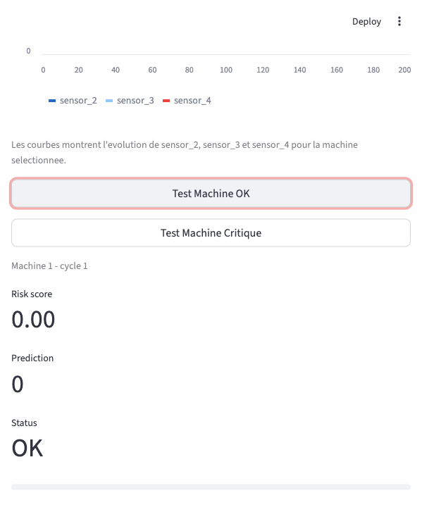
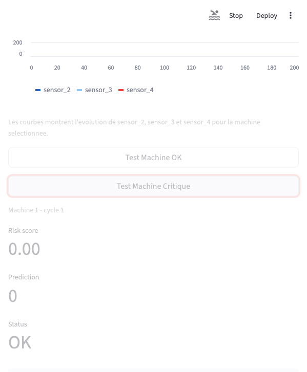

# Tableau de bord de maintenance predictive

## Objectif du projet

Ce projet construit une chaine simple de maintenance predictive :

- exploration des donnees capteurs
- creation de la cible RUL (Remaining Useful Life)
- entrainement d'un modele de classification OK / risque de panne
- estimation numerique du RUL avec un Random Forest Regressor
- detection d'anomalies multivariees avec Isolation Forest
- explication des predictions par les capteurs les plus contributeurs
- exposition du modele via une API FastAPI
- affichage des resultats dans un tableau de bord Streamlit

L'objectif est de predire si une machine est proche d'une panne et de retourner un score de risque exploitable par un moteur de decision.

Le systeme simule un moteur de decision capable de declencher automatiquement des actions de maintenance.

## Jeu de donnees utilise

Jeu de donnees : NASA CMAPSS Turbofan Engine Degradation Simulation Dataset.

Fichier utilise :

```text
train_FD001.txt
```

Colonnes principales :

- `unit_number` : identifiant de la machine
- `time_cycle` : cycle temporel
- `op_setting_1`, `op_setting_2`, `op_setting_3` : conditions operationnelles
- `sensor_1` a `sensor_21` : mesures capteurs
- `RUL` : duree de vie restante calculee
- `failure_label` : 1 si `RUL <= 30`, sinon 0

## Choix de data science

### Pourquoi ces capteurs ?

Le modele utilise les 21 capteurs disponibles (`sensor_1` a `sensor_21`) ainsi que les 3 conditions operationnelles (`op_setting_1` a `op_setting_3`).

Ce choix permet de conserver toute l'information utile au premier modele : les capteurs representent l'etat physique de la machine, tandis que les conditions operationnelles aident le modele a interpreter les mesures selon le contexte de fonctionnement.

Dans le tableau de bord, `sensor_2`, `sensor_3` et `sensor_4` sont affiches car ils montrent visuellement une evolution exploitable pour expliquer la degradation progressive d'une machine.

### Comment la panne est definie ?

La cible `RUL` est calculee avec :

```text
RUL = max_cycle_de_la_machine - time_cycle
```

La classification est ensuite definie ainsi :

```text
failure_label = 1 si RUL <= 30
failure_label = 0 sinon
```

Donc une machine est consideree en risque de panne lorsqu'il lui reste 30 cycles ou moins avant la fin de vie observee dans le dataset.

### Pourquoi ce modele ?

La classification utilise un `RandomForestClassifier`. Le RUL numerique est
estime par un `RandomForestRegressor`. Un `IsolationForest`, entraine sur les
cycles sains (`RUL > 30`), signale les observations atypiques.

Ce choix est adapte pour une premiere version car :

- il fonctionne bien sur des donnees tabulaires capteurs
- il gere des relations non lineaires entre capteurs
- il donne rapidement une reference solide
- il peut retourner une probabilite utilisee comme `risk_score`

Le modele n'est pas encore optimise pour la production, mais il est suffisant pour valider la chaine complete : donnees, entrainement, API et tableau de bord.

L'evaluation est faite avec un split groupe par `unit_number` (70/15/15) afin
d'eviter qu'une meme machine soit presente dans l'entrainement et le test.
La validation croisee `GroupKFold` a 5 plis donne un F1 moyen de 0.854 et le
jeu de test independant donne un F1 de 0.862. Pour le RUL, le jeu de test donne
une MAE de 27.23 cycles, une RMSE de 36.39 cycles et un R2 de 0.663.

Les capteurs contributeurs sont classes a partir de deux informations :
l'importance globale du capteur dans la Random Forest et l'ecart normalise de
la mesure courante par rapport au profil d'entrainement.

## Lancer l'API FastAPI

```bash
cd ~/Desktop/P1
source .venv/bin/activate
uvicorn api:app --reload
```

Documentation Swagger :

```text
http://127.0.0.1:8000/docs
```

Points d'entree operationnels :

- `GET /health` : etat du modele et nombre de variables
- `GET /metrics` : compteurs et latence au format Prometheus
- `POST /predict` : prediction validee par Pydantic

Si `P1_API_KEY` ou `PLATFORM_API_KEY` est defini, `POST /predict` exige le
header `X-API-Key`. Les endpoints `/health` et `/metrics` restent accessibles
sans cle pour les sondes et Prometheus.

## Lancer le tableau de bord Streamlit

Dans un deuxieme terminal :

```bash
cd ~/Desktop/P1
source .venv/bin/activate
streamlit run dashboard.py
```

Tableau de bord :

```text
http://127.0.0.1:8501
```

## Contrat API pour le moteur de decision

Point d'entree :

```text
POST /predict
```

Reponse exemple :

```json
{
  "prediction": 1,
  "status": "CRITICAL",
  "risk_score": 1.0,
  "rul_cycles": 8.42,
  "estimated_time_to_failure_hours": 8.42,
  "anomaly_detected": true,
  "anomaly_score": -0.0412,
  "top_contributing_sensors": ["sensor_11", "sensor_4", "sensor_15"],
  "model_version": "rf-1.2.0",
  "prediction_time_ms": 7.4
}
```

Interpretation :

- `prediction = 0` : machine OK
- `prediction = 1` : risque de panne
- `risk_score` : probabilite de risque entre 0 et 1
- `rul_cycles` : nombre de cycles restants estime
- `estimated_time_to_failure_hours` : approximation demonstrative avec
  l'hypothese d'un cycle egal a une heure
- `anomaly_detected` : observation atypique selon Isolation Forest
- `top_contributing_sensors` : capteurs qui expliquent le plus la prediction
- `status` : statut lisible pour le tableau de bord ou le moteur de decision

Niveaux de decision dans le tableau de bord :

- `risk_score <= 0.3` : OK, comportement stable
- `0.3 < risk_score < 0.7` : AVERTISSEMENT, debut de derive
- `risk_score >= 0.7` ou `prediction = 1` : RISQUE_DE_PANNE, derive progressive confirmee

## Transition DevOps

Commandes principales a integrer dans la suite DevOps :

```bash
uvicorn api:app --reload
streamlit run dashboard.py
```

L'API est prete a etre dockerisee : elle charge `model.joblib`, expose `/predict`, et retourne un contrat JSON stable pour le moteur de decision.

## Simulateur temps reel Kafka

Mode leger dans le terminal :

```bash
python simulator.py --machine-id 1 --interval 0.2
```

Publication continue dans Kafka lorsque Docker Compose est lance :

```bash
python simulator.py \
  --mode kafka \
  --machine-id 1 \
  --bootstrap-servers 127.0.0.1:29092 \
  --topic p1.sensor.readings \
  --interval 0.2 \
  --loop
```

## Test de charge

Apres demarrage de l'API :

```bash
python load_test.py --requests 100 --concurrency 5 --api-key demo-platform-key
```

Le script effectue un prechauffage puis affiche les latences moyenne, P50, P95
et le respect ou non de l'objectif P95 inferieur a 100 ms.

Mesure obtenue le 6 juin 2026 sur Docker Desktop pour Mac, API P1 isolee :

- 100 requetes, concurrence 1, aucune erreur
- moyenne : 78.14 ms
- P50 : 65.35 ms
- P95 : 162.22 ms

L'objectif P95 inferieur a 100 ms n'est donc pas encore valide sur cette
machine. Avec la stack complete, Kafka consomme fortement le CPU et augmente
encore la latence. Ce resultat est conserve comme limite mesuree et comme piste
d'optimisation, pas comme un engagement de service atteint.

## Captures d'ecran

Cas OK :



Cas critique :



## Lecture des graphiques du tableau de bord

Les capteurs CMAPSS ont des ordres de grandeur differents. Les afficher sur le
meme axe brut peut donner l'impression de lignes presque droites, meme lorsqu'une
derive existe.

Le tableau de bord final propose donc :

- une vue `base 100` pour comparer les variations relatives
- une vue normalisee par z-score avec moyenne glissante
- des graphiques bruts separes pour conserver les unites originales
- un indice synthetique de degradation de 0 a 100
- un tableau avec variation, pente et direction de chaque capteur

L'indice de degradation est un outil visuel. La decision automatique continue
d'utiliser le `risk_score` produit par le modele.

## Ressources pour le rapport

```bash
python generate_report_assets.py
```

Le dossier `report_assets` contient :

- `feature_importance.png`
- `feature_importance.csv`
- `model_metrics.csv`
- `dashboard_final_critical.png`

## Actions recommandees

- OK : continuer surveillance
- AVERTISSEMENT : surveillance renforcee
- RISQUE_DE_PANNE : alerte maintenance + creation incident simule
