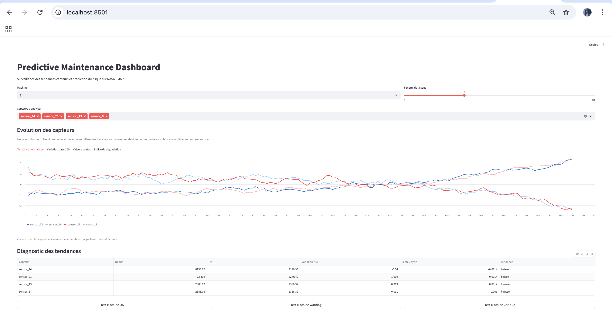
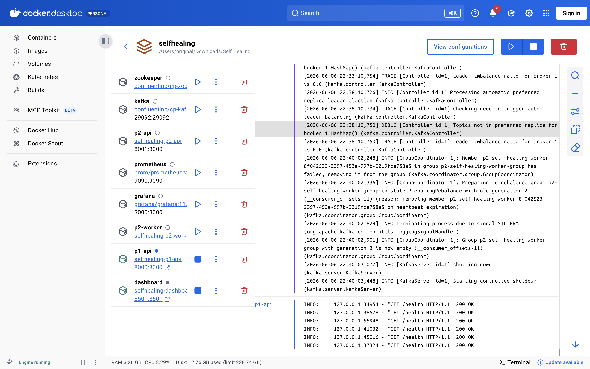
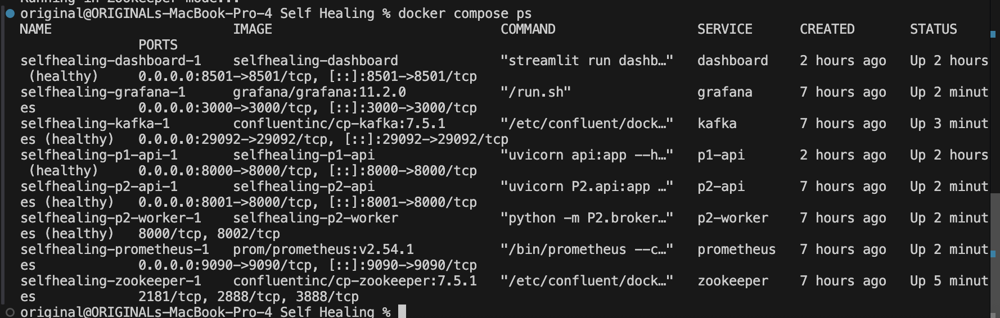
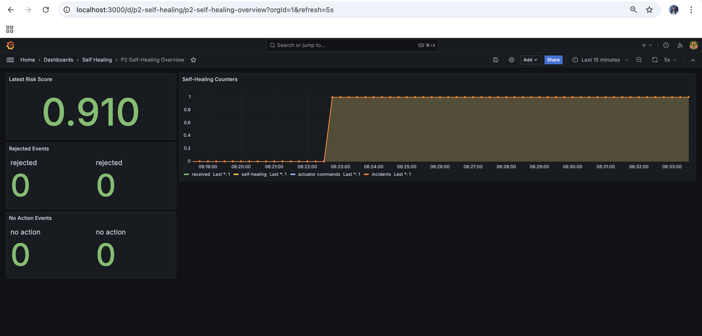
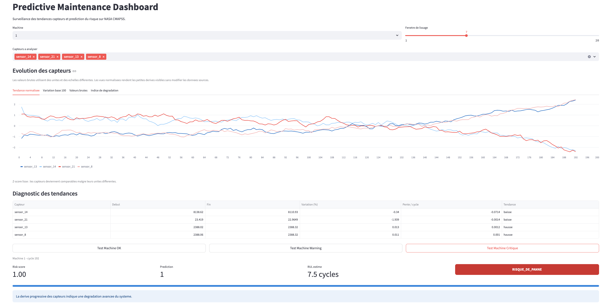
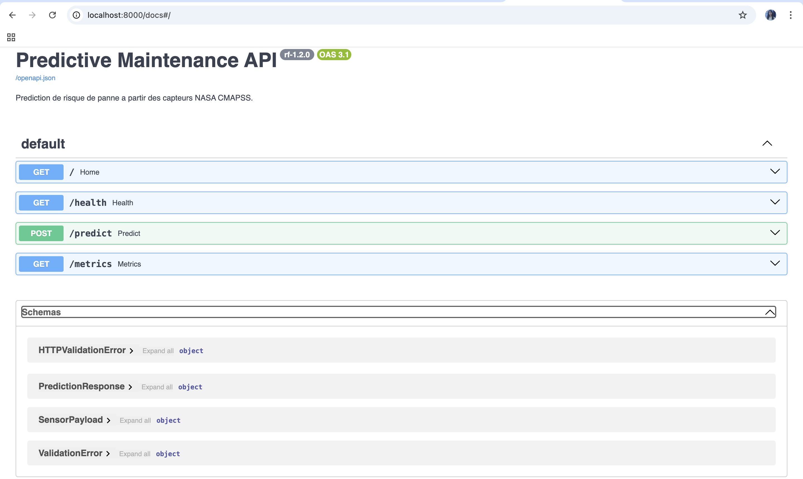
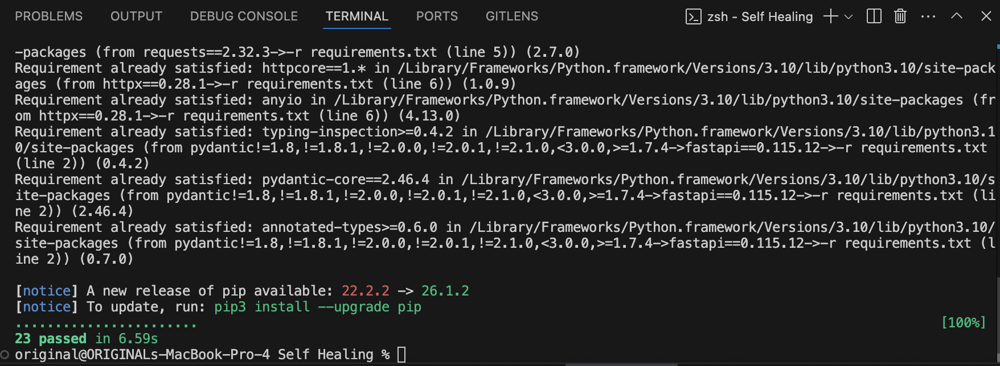

# 🛠️ Predictive Maintenance & Auto-Remediation Platform



## 📖 Overview

This project is not just a machine learning model—it is a **complete, end-to-end event-driven platform**. It is designed to demonstrate how an industrial system can detect potential failures and, more importantly, **automatically remediate them** before they cause critical downtime. 

The architecture is strictly decoupled into two distinct pillars:
- **Remediation Engine (The Core Focus):** The event-driven auto-remediation orchestrator. It listens to risk events, executes predefined playbooks, coordinates simulated actuators, and sends alerts (e.g., via Slack webhooks). 
- **Predictive Engine:** An independent predictive engine that analyzes NASA CMAPSS sensor data and exposes predictions via a REST API.

By completely decoupling these systems, the ML engine (Predictive Engine) can be entirely swapped or upgraded without ever touching the complex, event-driven remediation logic of Remediation Engine.

---

## 🏗️ Architecture: Two Independent Pillars



The system relies on an event-driven architecture powered by **Kafka**. 

1. **CMAPSS Simulator** reads raw sensor data and sends it to Predictive Engine.
2. **Predictive Engine** exposes a `/predict` endpoint that evaluates the risk score, RUL (Remaining Useful Life), and anomaly status.
3. A **Passerelle (Bridge)** links the two pillars by polling Predictive Engine and publishing high-risk events to Kafka.
4. **Remediation Engine** consumes these events from Kafka and executes the remediation playbooks.

---

## 🚀 Remediation Engine: The Auto-Remediation Engine

While training a predictive model is standard practice, **Remediation Engine** represents the true engineering complexity of this platform. It transforms passive predictions into **active, automated responses**.



### Deep-Dive into Remediation Engine Technical Architecture
- **Event-Driven Broker (Kafka)**: Decouples event generation from playbook execution. It ensures high throughput, fault tolerance, and guarantees message delivery even during traffic spikes.
- **Idempotent Playbook Execution**: The Remediation Engine worker is the sole authority for executing remediation logic. It includes state management to prevent duplicate actuator commands (e.g., stopping a turbine twice) while an incident is already ongoing.
- **Strict Payload Validation**: Every incoming Kafka event is validated against a strict schema to prevent malformed data from triggering unsafe physical commands.
- **Simulated Actuator Control**: Dynamically triggers industrial commands (like `REDUCE_RPM_BY_20`) based on calculated severity thresholds and contextual rules.
- **Incident State Tracking (SQLite)**: Logs all incidents systematically into a local SQLite tracking database for auditability and compliance, effectively serving as an automated ticketing system.
- **Real-Time Alerting**: Pushes urgent notifications to a mock Slack webhook to keep human operators in the loop while the system self-heals.
- **Kubernetes Ready**: Fully containerized and orchestrated. Contains provided manifests (`k8s/platform.yaml`) for scaling workers and brokers in a Kubernetes environment.

### Observability
The platform integrates **Prometheus** and **Grafana** to monitor system health, API latency, and prediction metrics in real-time.



---

## 🧠 Predictive Engine: Independent Predictive Engine

Predictive Engine is a standalone Machine Learning application. It was trained on the NASA CMAPSS dataset using a RandomForest approach with 5-fold `GroupKFold` validation to predict engine degradation.



### Independence & Extensibility
Predictive Engine exposes a clean, documented **FastAPI** interface. It has no knowledge of Kafka, actuators, or playbooks. Because it is completely decoupled:
- The NASA CMAPSS model could be replaced by a visual inspection model.
- The entire ML stack could be rewritten in another language.

As long as the new engine respects the simple `/predict` contract, **Remediation Engine remains unaffected**.



---

## ⚡ Quick Start (Docker Compose)

The easiest way to launch the complete platform locally is via Docker Compose:

```bash
docker compose up --build
```

**Available Services:**
- **Predictive Engine Swagger (API)**: [http://localhost:8000/docs](http://localhost:8000/docs)
- **Remediation Engine Console**: [http://localhost:8001/ui](http://localhost:8001/ui)
- **Streamlit Dashboard**: [http://localhost:8501](http://localhost:8501)
- **Mock Slack Webhook**: [http://localhost:8010/notifications](http://localhost:8010/notifications)
- **Grafana**: [http://localhost:3000](http://localhost:3000) *(admin/admin)*
- **Prometheus**: [http://localhost:9090](http://localhost:9090)

---

## 🎬 End-to-End Demonstration

To see the auto-remediation in action, wait for the stack to start, then trigger a critical event simulation:

```bash
python3 -m remediation_engine.p1_to_p2_bridge \
  --payload-file predictive_engine/critical_payload.json \
  --machine-id TURBINE_042 \
  --p1-url http://127.0.0.1:8000/predict \
  --p2-url http://127.0.0.1:8001/events \
  --p1-api-key demo-platform-key \
  --p2-api-key demo-platform-key
```

**What happens next?**
1. The event is validated and sent to Kafka.
2. The Remediation Engine worker picks it up and executes the remediation playbook.
3. You can see the incident notification on the mock Slack service at `http://localhost:8010/notifications`.

*(See [docs/DEMO_RUNBOOK.md](docs/DEMO_RUNBOOK.md) for detailed demonstration scripts.)*

---

## 🛡️ CI/CD & Engineering Rigor

This project is built with production standards in mind. 

- **GitHub Actions**: Fully automated CI/CD pipelines (`.github/workflows/platform-ci.yml`, `p2-docker-ci.yml`).
- **Kubernetes Validation**: Automated `dry-run` testing against real K8s APIs.
- **Comprehensive Testing**: Validated by an extensive `pytest` suite ensuring the bridge, API, ticketing database, and ML models all function perfectly.



---

## 👥 Collaborators

- **Predictive Engine (Machine Learning & Data Science):** Imane Tayf
- **Remediation Engine (Auto-Remediation & Platform Orchestration):** Belga Alaa
